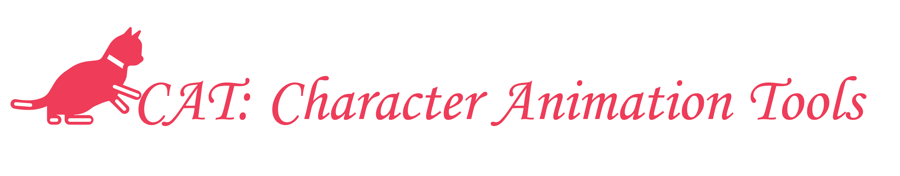
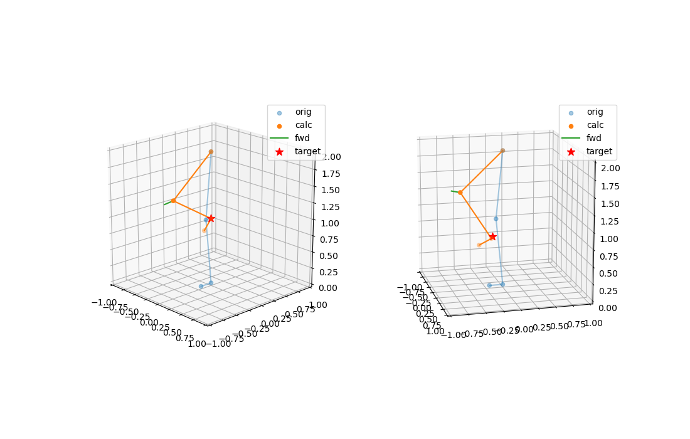
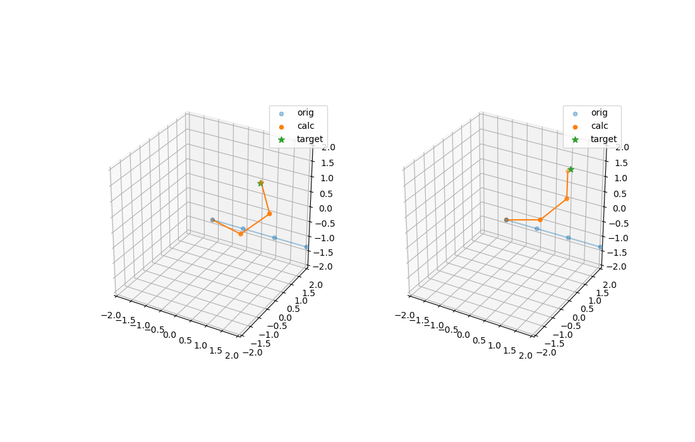
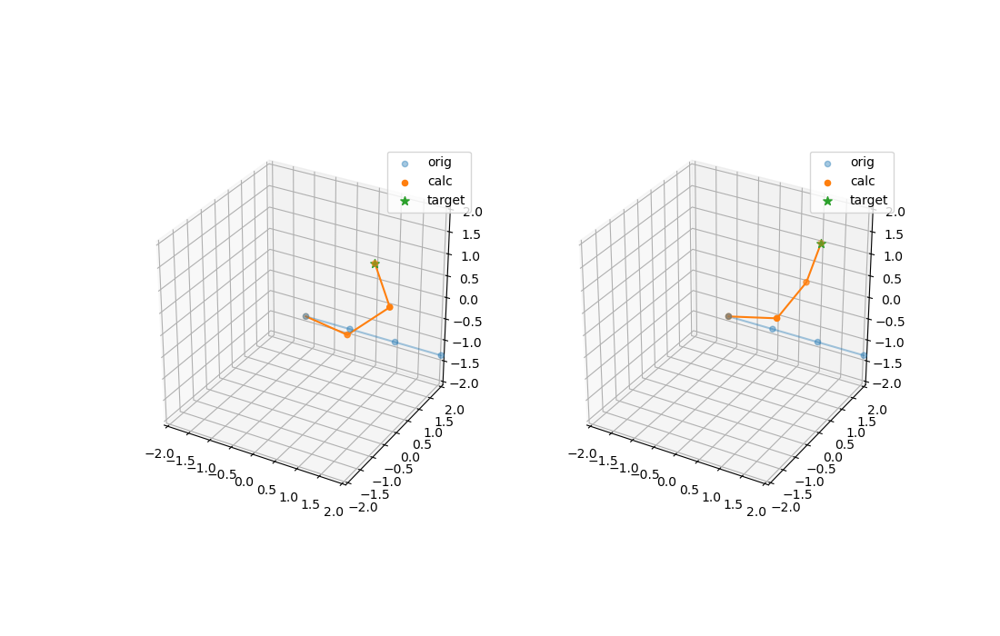
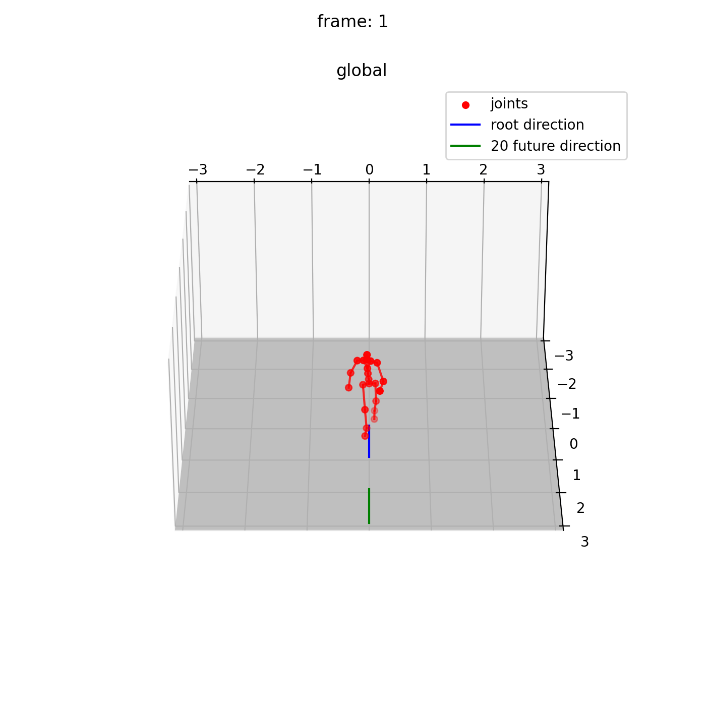

<p align="center">
    <picture>
    
    </picture>
</p>

<h2 align="center">
CAT: Character Animation Tools for Python
</h2>

This repository includes scripts for Character Animation.
All the code is written entirely in python.

It is useful for pre-processing and post-processing motions in **Deep Learning**.  
It will be also useful for create character animations.

## :star: Requirements
I tested on python3.10 (for match-case syntax).

### Package
* NumPy
* SciPy
* matplotlib
* chumpy (if you use vanilla SMPL for AIST++).
* easydict
<!-- 
TBD
* PyTorch
* JAX
* taichi 
* faiss-gpu
-->

### Motion Data
Some of the scripts in this repository need motion data below.  
Please download them and place them in [`data/`](data) or link them as symbolic links at [`data/`](data). For more information please see [`data/data.md`](data/data.md).
* [Ubisoft La Forge Animation Dataset (LAFAN1)](https://github.com/ubisoft/ubisoft-laforge-animation-dataset)
* [SMPL](https://smpl.is.tue.mpg.de/)
* [SMPL+H](https://mano.is.tue.mpg.de/)
* [SMPL-X](https://smpl-x.is.tue.mpg.de/)
* [AMASS](https://amass.is.tue.mpg.de/)
* [AIST++](https://google.github.io/aistplusplus_dataset/factsfigures.html)


## :question: How to use?

### 1. Load and Save Animation
<details>
<summary>open</summary>  

#### 1.1 Load Animation from [bvh](https://research.cs.wisc.edu/graphics/Courses/cs-838-1999/Jeff/BVH.html) file.
```Python
from anim import bvh
from anim.animation import Animation
anim_bvh: Animation = bvh.load(filepath="data/**.bvh")
```

#### 1.2 Load Animation from [AIST++](https://google.github.io/aistplusplus_dataset/factsfigures.html).
You need to install chumpy to use vanilla SMPL model.
```Python
from anim import aistpp
anim: Animation = aistpp.load(
    aistpp_motion_path="data/aistpp/**.pkl",
    smpl_path="data/smpl/neutral/model.pkl"
)
``` 

#### 1.3 Load Animation from [AMASS](https://amass.is.tue.mpg.de/).
I recommend you to download extended SMPL+H model (16 beta components).
```Python
from anim import amass
anim: Animation = amass.load(
    amass_motion_path="data/amass/**.npz",
    smplh_path="data/smplh/neutral/model.npz"
)
```

#### 1.4 Save as bvh.
You can convert SMPL based motion files (AIST++, AMASS) to BVH files.
```Python
from anim import bvh
from anim.animation import Animation

...

anim: Animation
bvh.save(
    filepath="data/***.bvh",
    anim=anim
)

```

<!-- 
#### 1.5 Other animation format
TBD  
-->

</details>


### 2. Get motion features
<details>
<summary>open</summary>

#### 2.1 Get positions (global, root-centric, character space).
```Python
import numpy as np
from anim.animation import Animation

...

anim: Animation
global_positions: np.ndarray = anim.gpos
rcentric_positions: np.ndarray = anim.rtpos
cspace_positions: np.ndarray = anim.cpos
```

#### 2.2 Get velocities(positions, rotations).
```Python
anim: Animation
pos_velocities: np.ndarray = anim.gposvel
rot_velocities: np.ndarray = anim.lrotvel
``` 

#### 2.3 Get mirrored Animation.  
(**caution**: Skel offsets must be symmetric.)
```Python
anim: Animation
anim_M: Animation = anim.mirror()
```
</details>


### 3. Inverse Kinematics
<details>
<summary>open</summary>

#### 3.1 Two bone IK
Analytical method of foot IK example (define heels positon and knees forward vector).
```bash
python anim/inverse_kinematics/two_bone_ik.py
```


#### 3.2 CCD-IK
Simple demo.
```bash
python anim/inverse_kinematics/ccd_ik.py
```


#### 3.3 FABRIK
Simple demo.
```bash
python anim/inverse_kinematics/fabrik.py
```


<!-- 
#### 3.4 Jacobian IK
TBD 
-->

</details>


### 4. Motion Blending
<details>
<summary>open</summary>

#### 4.1 Linear blending for pose.
TBD

</details>


### 5. Motion Matching
<details>
<summary>open</summary>

#### 5.1 Character Control by predefined trajectories

```python
python test/path_following.py
```



<!-- 
#### 5.2 Character Control by user input
```python
python test/character_controller.py
``` 
-->

</details>

<!--
### 6. Graph animation
<details>
<summary>open</summary>

#### Motion Graphs
TBD

#### State Machine
TBD

</details>


### 7. KeyFrame Animation
<details>
<summary>open</summary>

#### Extract keys from Animation
TBD

#### KeyFrame reduction
TBD

#### Create Animation from keyframes
TBD

</details>


### 8. Crowd Simulation
<details>
<summary>open</summary>

#### Collision avoidance
TBD

#### Following path
TBD

</details>


### 9. Skinning
<details>
<summary>open</summary>

#### Linear Blend Skinning
TBD

#### Dual-Quaternions Blend Skinning
TBD

</details>


### 10. Animation Retarget
<details>
<summary>open</summary>

#### Rotation copy
TBD

#### IK-based retarget
TBD

</details>
-->


<!-- 
## :zap: Deep Learning 
-->


## :eyes: Notification
* [`util/quat.py`](util/quat.py) inspired by [Motion-Matching](https://github.com/orangeduck/Motion-Matching).
* This repository is MIT licensed, but some datasets requires a separate license. Please check them.

## :speech_balloon: Contact
This repository is under construction.  
Feel free to contact me on [issue](https://github.com/KosukeFukazawa/CharacterAnimationTools/issues).

## :books:License
This code is distributed under an [MIT LICENSE](LICENSE).